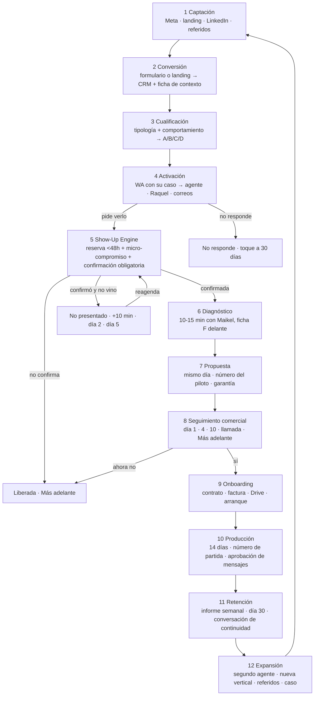

# Sistema comercial Qualivo v1 · del desconocido al promotor

```
PARA       Maikel · 24-sep-2026
QUÉ ES     el sistema operativo completo, en 12 etapas, de captación, cualificación, activación, show-up,
           diagnóstico, propuesta, seguimiento, onboarding, producción, retención y expansión de Qualivo
BASE       lo que ya existe y funciona (Notion «Sistema comercial Qualivo · cómo funciona hoy», 11 páginas,
           24-sep) · la auditoría de la semana 38 · el Proceso v3 · la estructura de mensajes aprobada el
           23-sep · el primer cliente cerrado el 23-sep (reformas, 1.000 € + 750 €/mes)
MARCAS     ⚙️ automático y en producción · 🙋 lo hace una persona · 🆕 nuevo en este diseño · [DECISIÓN] tuya
REGLA      cada etapa lleva objetivo, mensaje, estado emocional, fricciones, automatizaciones, acciones
           humanas, mensajes literales por canal, agentes, CRM, métricas, triggers, árbol de decisión,
           casos especiales, riesgos y protocolo. Ningún nombre de lead. Ninguna cifra inventada.
```

## 0. Cómo piensa este sistema

**El cliente recibe decenas de impactos al día.** Un dueño de clínica, academia, empresa de reformas o despacho ve entre 30 y 60 anuncios, recibe mensajes de proveedores y tiene el móvil lleno de WhatsApps de clientes. Nuestro mensaje compite con todo eso. Por tanto:

1. **Cada mensaje demuestra que hemos mirado su caso** (lo que marcó, lo que escribió, lo que vemos en su web). Nunca una plantilla que finge.
2. **Cada mensaje reduce una incertidumbre concreta**: quién eres, qué quieres, cuánto me va a costar de tiempo, qué gano, qué pasa después.
3. **Cada mensaje pide una sola cosa**, fácil de hacer desde el móvil en 10 segundos.
4. **La rapidez es lo primero que vendemos**: si tardamos, el sistema se desmiente a sí mismo. Nunca pedimos perdón por tardar: no tardamos.
5. **La memoria del sistema es la experiencia**: lo que dijo al agente lo sabe Raquel; lo que dijo a Raquel lo sabe Maikel; lo que se acordó en la reunión está en la propuesta; lo que se prometió en la propuesta se mide en el piloto.
6. **Nada sale dos veces igual, nada sale en punto, nada sale de noche, nada sale sin leer el hilo.**
7. **Un cliente promotor no se pide: se fabrica** con un número que se cumplió, un informe que lo demuestra y un momento en el que se le pregunta a quién más le vendría bien.

**El recorrido en una línea:** Anuncio o contenido → formulario o landing → ficha de contexto → primer mensaje con su caso → conversación (agente) o llamada (Raquel) → reserva con micro-compromiso → confirmación obligatoria → diagnóstico con Maikel → propuesta el mismo día → seguimiento con motivo → cierre, contrato y factura → arranque en 14 días → número de partida y número a 30 días → informe semanal → conversación de continuidad → segundo agente y referidos.

---

## 1. Análisis previo (los diez puntos)

| Punto | Lo que hay (24-sep) | Lo que condiciona el diseño |
|---|---|---|
| **Negocio** | Qualivo pone agentes de IA (WhatsApp, voz, seguimiento, puntuación, reporting) sobre el sistema comercial que ya tiene una pyme. Una persona vende (Maikel), un agente de operaciones monta y vigila, un agente de Paid lleva anuncios, un agente de Growth lleva el recorrido. 1 cliente nuevo cerrado el 23-sep; 3 clientes anteriores (relaciones previas). | El cuello de capacidad es Maikel: reuniones de 10-15 min, propuestas el mismo día, aprobaciones. Todo lo que no requiera su criterio debe hacerlo el sistema. |
| **Oferta** | Diagnóstico gratuito → plan por escrito → piloto de 30 días. Precio: 1.000 € el primer mes (dos pagos de 500 €) + 750 €/mes, sin permanencia. Garantía del contrato: si a los 3 meses no se ha recuperado la inversión, 3 meses más sin coste de gestión. Anuncios aparte. | Tres garantías distintas conviven (web, presentación, contrato). El sistema necesita **una** frase de garantía y **un** número de piloto por vertical. |
| **Cliente ideal** | Clínicas, academias, reformas, asesorías en España; invierte algo en captación o tiene volumen (más de 20 peticiones al mes); el dueño decide. Semana 38: 7 de 20 leads eran ICP. Clínicas: mejor calidad, único cliente potencial con reunión hecha; reformas: primer cliente cerrado, pero 7 de 8 «no lo sé». | Cualificar por **comportamiento y contexto**, no solo por lo que declara. El «no lo sé» no descarta: obliga a poner contexto nosotros. |
| **Competencia** | Agencias de captación (traen leads), herramientas de chatbot (venden «el bot»), CRMs con automatización (venden software). Nadie vende «que no se te caiga ninguno» con garantía sobre un número. | La diferencia se cuenta en 20 palabras: «no traemos más leads: hacemos que no se pierdan los que ya llegan, y lo medimos». Nunca vender «agentes» en frío. |
| **Proceso comercial** | Escrito (proceso-comercial.md v0, v2, v3) y en parte en código. Reglas de aprobación claras. Del lead a la cita funciona (45 %). De la cita a la reunión no (1 de 6). | El sistema tiene que hacer obligatorio lo que hoy es opcional: confirmación, cierre del resultado, no-show. |
| **Funnel actual** | Semana 38: 291,90 € → 146 clics → 20 leads → 6 contestan → 9 citas → 6 resueltas → 1 reunión → 1 propuesta. Desde el 16-sep: 26 leads, 14 citas, 6 no presentados, 3 reuniones, 1 cliente. | Show-Up Engine es la etapa que más ingreso libera. Captación no es el problema. |
| **CRM** | GoHighLevel: pipeline Prospección (10 etapas), pipeline de reactivación, puntuación A-D automática, notas por evento, avisos. Etapas No presentado, Oferta, Negociación, Más adelante, Piloto y Cliente se mueven a mano. | Todo estado que decide un mensaje tiene que ponerlo el sistema o un clic de Maikel, nunca «acordarse». |
| **Automatizaciones** | Webhook Meta, rescate, cadencia (WA1, voz1, WA2, voz2, correos 2/6/9, WA3), agente de WhatsApp, Raquel, reserva, confirmación, recordatorios 9:00 y víspera, reenganche 1/3/5, scoring, tareas de trato parado, freno de 3 mensajes, tope de pasarela, demo /prueba. | Faltan: confirmación procesada y liberación, no-show, cierre del resultado, ficha de contexto, respaldo por correo, onboarding automatizado, informe al cliente, señales de churn, referidos. |
| **Canales** | Meta Ads (único de pago), landing y formulario nativo, WhatsApp 647 (plantillas por workflow; envío directo sin permiso) y pasarela 663 (restringida), voz (Vapi desde el móvil de Maikel), correo (Resend), LinkedIn (HeyReach, apagado desde el 7-sep, 5,7 % de respuesta), outbound por correo («Señales», entregabilidad rota), reactivación de base (Brevo + Raquel). SMS: nunca (regla de Maikel). | Un solo canal sancionado de WhatsApp (647) + correo como respaldo + voz. LinkedIn es el canal en frío que hay que reabrir cuando el Show-Up Engine funcione. |
| **Equipo** | Maikel (vende, decide, aprueba, hace las reuniones y el onboarding). Agente de operaciones (monta, vigila, corrige a Raquel, escribe informes). Paid (anuncios). Growth (recorrido y dailies). Raquel (voz). Agente de WhatsApp. | Roles y aprobaciones definidos en el SOP-0. Lo que hoy hace Maikel a mano y no requiere criterio (confirmar citas, cerrar resultados, mover tratos) pasa al sistema. |

---

## 2. Arquitectura: estados, roles y reglas globales

### 2.1 Diagrama lógico del recorrido



### 2.2 Estados del CRM (pipeline Prospección) y quién los pone

| Etapa | Entra cuando | Lo pone | Sale cuando |
|---|---|---|---|
| Nuevo lead | webhook o landing | ⚙️ | primer mensaje entregado |
| En cadencia 🆕 (hoy existe sin uso) | primer mensaje entregado | ⚙️ | contesta, agenda, baja o cadencia agotada |
| Conversación abierta | contesta o habla con Raquel | ⚙️ | agenda o se para |
| Reunión agendada | cita creada | ⚙️ | confirmada, liberada, hecha o no presentado |
| Confirmada 🆕 | responde «sí» a la víspera o Raquel confirma | ⚙️ | hecha / no presentado |
| No presentado | cita confirmada sin conexión, marcada por Maikel en un clic | ⚙️🆕 (hoy 🙋) | reagenda o Más adelante |
| Reunión hecha 🆕 | clic de Maikel al colgar | ⚙️🆕 | propuesta enviada |
| Oferta enviada | propuesta enviada | ⚙️🆕 (hoy 🙋) | sí / ahora no / no |
| Negociación | el lead responde a la propuesta con dudas o condiciones | 🙋 | cierre |
| Más adelante | «ahora no» con fecha | 🙋 | fecha del toque |
| No responde | cadencia agotada | ⚙️ | toque a 30 días |
| Piloto | contrato firmado y primer pago | 🙋 | día 30 |
| Cliente | continuidad tras el piloto | 🙋 | baja |

Regla: **ningún trato retrocede**; los reagendados vuelven a «Reunión agendada» con nota, no a «Nuevo».

### 2.3 Roles

| Rol | Hace | No hace |
|---|---|---|
| **Sistema** (crons y webhooks) | entrada, ficha de contexto, cadencia, reserva, confirmación, liberación, recordatorios, no-show, scoring, tareas, informes, avisos | precio, descuentos, mensajes a Negociación o superior sin aprobación |
| **Agente de WhatsApp** | conversa como Maikel dentro de las 24 h, entiende la fuga, ofrece dos huecos, reserva, pide el micro-compromiso, procesa la confirmación de víspera, reengancha, redacta borradores de seguimiento | precio, garantías concretas, casos con cifras no publicadas, más de 5 mensajes, contactos en Negociación o superior |
| **Raquel** (voz) | llama cuando el mensaje está entregado, dos preguntas, hueco solo a quien lo pide, confirmación de víspera, no-show, reintentos con contexto | precio en firme, más de dos llamadas sin conversación, llamar a quien contestó por WhatsApp |
| **Maikel** | decide, aprueba, hace el diagnóstico, cierra el resultado en un clic, envía la propuesta, hace el onboarding y la conversación de continuidad | confirmar citas a mano, mover tratos a mano, escribir primeros mensajes |
| **Agente de operaciones** | monta y vigila el sistema, corrige a Raquel a diario, informe del viernes, informe semanal al cliente, señales de churn | escribir a leads o clientes sin aprobación |
| **Paid** | anuncios, formulario, coste por reunión hecha, plataformas, A/B | activar o subir presupuesto sin ok |

### 2.4 Reglas globales (SOP-0)

1. Leer el hilo entero (647, 663, correo, notas, llamadas) antes de escribir. Si Maikel escribió en las últimas 24 h, el agente no entra.
2. Un mensaje, una pregunta, sin párrafos. Nunca dos seguidos sin respuesta. Nunca más de uno cada 4 h (🆕 en código, hoy solo escrito). Nunca en punto (:07, :23, :41, :52). Nunca de noche (WhatsApp 8:00-21:30; voz L-V 9:00-14:00 y 16:00-20:00, sábado 10:00-14:00; correo 8:00-21:00 🆕).
3. Canales: WhatsApp solo por el 647 (plantilla para abrir, texto libre dentro de las 24 h); correo como respaldo obligatorio de confirmaciones y recordatorios; voz Raquel desde el móvil de Maikel; SMS nunca; 663 solo Maikel a mano.
4. Freno de 3 mensajes sin respuesta en 24 h (⚙️). Tope de pasarela 20/día (⚙️). Máximo 2 llamadas sin conversación por lead, y no más de 2 buzones el mismo día (🆕).
5. Estado, no etiqueta: un mensaje cuenta cuando está **entregado**; una llamada cuando **sonó**; una cita cuando está **confirmada**; una reunión cuando Maikel la cierra como **hecha**.
6. Precio, descuentos, piloto en abierto, garantías concretas y cualquier mensaje a Negociación, Oferta, Piloto o Cliente: solo con aprobación de Maikel. Los mensajes cortos del playbook (recordatorios, respuestas del agente, cierres de un no, nueva hora) salen sin preguntar.
7. Datos personales de leads y clientes: en el CRM y en Drive, nunca en el repositorio público ni en el bus. Códigos en todo lo que se publique.
8. Cada viernes: cuadro de mando con un solo origen (citas de GHL cerradas el mismo día), patrones de las conversaciones y tres decisiones.

### 2.5 Triggers globales

| Trigger | Origen | Qué dispara |
|---|---|---|
| `lead.entra` | webhook Meta / landing / LinkedIn / referido | etapa 2 |
| `contexto.listo` | `_contexto.js` (🆕) en ≤ 60 s | primer mensaje |
| `mensaje.entregado` | estado del mensaje en GHL | reloj de la llamada (20 min) |
| `lead.contesta` | webhook «cliente ha respondido» | agente de WhatsApp; para la cadencia |
| `lead.pide_hueco` | agente / Raquel / calendario | reserva + micro-compromiso |
| `cita.creada` | GHL | confirmación única, evento Schedule, etapa Reunión agendada |
| `vispera.18:30` | cron | confirmación obligatoria |
| `confirmacion.sin_respuesta_2h` | cron | Raquel llama |
| `dia.9:00.sin_confirmar` | cron | liberación (si [DECISIÓN 3] = sí) |
| `cita.hora+10min.sin_conexion` | clic de Maikel o ausencia de `reunion-celebrada` | no-show |
| `reunion.cerrada` | clic de Maikel (hecha / no vino / movida) | propuesta o no-show; scoring; hoja; Meta |
| `propuesta.enviada` | Maikel aprueba | seguimiento día 1/4/10 |
| `contrato.firmado + pago.1` | Quipu / Maikel | onboarding |
| `dia.14 / dia.30 del piloto` | cron | informe y conversación de continuidad |
| `cliente.numero_cumplido` | informe | pedir referido y caso |
| `cliente.señal_churn` | informe semanal | protocolo de retención |

---

## 3. Las doce etapas

Formato de cada etapa: objetivo · mensaje principal · estado emocional · fricciones · automatizaciones · acciones humanas · mensajes por canal (email, WhatsApp, SMS, llamada) · agentes de IA · CRM · métricas y KPIs · triggers y condiciones · árbol de decisión · casos especiales · riesgos · protocolo.

### Etapa 1 · Captación

**Objetivo.** Que el dueño que ya pierde clientes por el camino se reconozca en 5 segundos y dé el primer paso sin sentir que le venden.

**Mensaje principal.** «Te piden precio (o presupuesto, o información). ¿Y después qué? Miramos qué pasa desde que alguien te pide hasta que te paga, y ponemos un agente justo donde se pierde. Sin cambiar tu CRM ni contratar a nadie.» Nunca «agentes» como titular en frío; sí el resultado («que ninguno se quede sin respuesta»).

**Estado emocional.** Escepticismo («otra agencia»), culpa difusa («sé que se me escapan»), prisa. Lo que le hace parar: ver su situación descrita con precisión y un coste que no le exige nada todavía.

**Fricciones.**

| Fricción | Cómo se reduce |
|---|---|
| El anuncio promete «a las 9:30 le ha llamado una voz» y el sistema no lo cumple de noche o en fin de semana | O se cumple (etapa 4) o el anuncio dice «en cuanto abrimos» |
| Público abierto, frecuencia 2,0 a los cinco días en reformas | Rotación creativa cada 10 días; un anuncio por fuga (respuesta / seguimiento / captación) además del genérico |
| Instagram feed 2,77 €/clic frente a Facebook feed 1,45 € | Conjuntos separados por plataforma |
| Reformas atrae «no lo sé» (7 de 8) | Oferta de reformas «que ningún presupuesto se quede sin respuesta» y caso Antic (visita en menos de 24 h) en vez de un caso de 28.500 € |

**Automatizaciones ⚙️.** Píxel + API de conversiones (Lead, Schedule); 🆕 evento «reunión hecha» y «cliente» de vuelta a Meta para que optimice a lo que importa; informe de Paid 7:00 y 18:00; alerta si CPL supera 45 €; 🆕 alerta si el coste por reunión hecha de un conjunto supera 150 € en 7 días → se pausa y se avisa.

**Acciones humanas 🙋.** Paid: creatividades, A/B del formulario, presupuestos (solo con ok). Maikel: aprueba presupuesto y creatividades; un vídeo de 60 s por vertical cada mes. Agente de contenido: 3 piezas semanales de LinkedIn con el mismo mensaje (SOP en sistema-contenidos).

**Mensajes.** Email: ninguno en esta etapa. WhatsApp: ninguno. SMS: nunca. Llamadas: ninguna. LinkedIn (🆕 reabrir HeyReach, canal validado con 5,7 % de respuesta): «Hola {nombre}, vi que en {empresa} {señal: estáis contratando comercial / habéis abierto centro}. Una pregunta corta: cuando os pide información alguien un sábado, ¿quién le contesta y cuándo? Lo pregunto porque es donde más se pierde en {sector}.» Segundo toque a los 4 días con el caso más parecido publicado. Tercero a los 10 días con el enlace a /prueba/.

**Agentes de IA.** Paid (análisis y propuestas), agente de contenido, 🆕 «lector de señales» (empresas que contratan comerciales, abren centro, invierten) para LinkedIn y correo.

**CRM.** Origen y anuncio en el trato (`creativo-`, UTM); 🆕 campo `canal_captacion` (meta-form, landing, linkedin, referido, contenido, base).

**Métricas y KPIs.** Coste por reunión hecha (KPI de Paid desde el 22-sep); coste por cita; clic→envío; % ICP por canal; frecuencia; coste por clic por plataforma. Objetivos a 30 días: coste por reunión hecha < 100 €; clic→envío > 25 %; % ICP > 50 %.

**Triggers y condiciones.** Alta de conjunto solo con creatividad + formulario + landing de destino revisados; pausa automática por coste por reunión; reactivación de LinkedIn cuando la asistencia de la etapa 5 supere el 60 % dos semanas seguidas (no antes: más leads en un embudo que pierde citas es perder más caro).

**Árbol de decisión (presupuesto semanal).**
- Coste por reunión hecha < 100 € y asistencia > 60 % → subir 5 €/día al conjunto.
- Coste por reunión hecha 100-200 € → mantener, cambiar creatividad.
- > 200 € o 0 reuniones en 14 días con más de 100 € → pausar y revisar oferta de esa vertical.
- Asesorías: 14 días completos con el formulario nuevo; si 0 envíos, cerrar.

**Casos especiales.** Lead de un formulario antiguo → se guarda y no se activa (regla de agosto). Lead de prueba de Meta → se descarta. Lead fuera de vertical → entra, sector «otro», misma cadencia, sin caso de sector.

**Riesgos.** Vender «agentes» en frío (pide precio de software); optimizar a lead en vez de a reunión; un script tocando presupuestos sin decisión (pasó el 20-sep).

**Protocolo SOP-1.** (1) Cada lunes Paid entrega coste por reunión hecha por conjunto y plataforma. (2) Toda pausa o activación se anota en el bus con hora y motivo. (3) Nada sube de presupuesto sin ok escrito. (4) Creatividad nueva cada 10 días por vertical. (5) Cada anuncio promete solo lo que la etapa 4 cumple.

---

### Etapa 2 · Conversión (del clic al lead con contexto)

**Objetivo.** Que quien abre el formulario lo envíe (hoy 14 %; sano 25-40 %) y que cada envío llegue **con contexto** suficiente para que el primer mensaje sea suyo.

**Mensaje principal.** «Dos minutos. Dime qué se te escapa y te digo dónde mirar. Y si prefieres, coge hora ya.»

**Estado emocional.** Curiosidad con prisa. Miedo a que le llamen pesados. Necesita saber qué pasará después de enviar.

**Fricciones.**

| Fricción | Cómo se reduce |
|---|---|
| Pregunta de inversión antes de dar nada a cambio (repele: 128 de 149 abandonan) | 🆕 Formulario: pregunta abierta obligatoria («¿qué es lo que más se te escapa ahora mismo?») + «¿cuántas personas sois?»; inversión al final y opcional, o en la conversación |
| Nombre y empresa intercambiados (3 de 5) | Orden: nombre → empresa → teléfono → email; etiquetas claras |
| Sin campo libre → «no lo sé» sin contexto | La pregunta abierta y la lectura de su web |
| Pantalla de gracias promete «en unos minutos» y no siempre | Texto honesto según hora: «Te escribo ahora / mañana a partir de las 9» |
| La portada manda a otro formulario y otro calendario | Un solo formulario y un solo calendario en todo el sitio |
| «24 h» en unas páginas y «48 h» en otras | Una sola promesa: plan por escrito **en 24 h** desde la reunión |

**Automatizaciones ⚙️.** Webhook + rescate cada 10 min; upsert con etiquetas de contexto; trato en Nuevo; aviso a Maikel (correo; 🆕 móvil por el 647); evento Lead; correo de recibido (🆕 con la promesa correcta según hora). 🆕 `_contexto.js`: lee su web (reutiliza `_demo.js`), guarda `web_tiene_whatsapp`, `web_formulario`, `web_horario`, `web_servicios`, `observacion` (una frase útil y comprobada) y `email_dominio`; si no hay web, busca por nombre de empresa; si falla, sigue sin observación.

**Acciones humanas 🙋.** Ninguna por lead. Paid duplica el formulario para el A/B (Meta no deja editar uno con leads).

**Mensajes.**
- Email (recibido, minuto 0, ⚙️): asunto «{nombre}, recibido». «He recibido tu solicitud. Soy Maikel, de Qualivo. {Ahora mismo / Mañana a partir de las 9} te escribo por WhatsApp con una pregunta sobre tu caso, para que la llamada vaya directa a lo tuyo. Si prefieres coger hora tú: {enlace}.» Sin «15 minutos».
- WhatsApp: ninguno todavía (etapa 4).
- Pantalla de gracias (Meta y landing): «Hecho. {Ahora mismo / Mañana a partir de las 9} te llega un WhatsApp de Maikel con lo que montaríamos en tu caso. Si prefieres coger hora tú: Elegir hora ahora.»

**Agentes de IA.** 🆕 Lector de web (ficha de contexto en 60 s). Puntuación de tipología al segundo 0.

**CRM.** Etiquetas `paid`, `leadform`/`landing`, sector, inversión, volumen, fuga, anuncio, `form-`, `meta-lead-`; nota con las respuestas literales; 🆕 campos de contexto; 🆕 `hipotesis_lead` (lo que escribió).

**Métricas y KPIs.** Clic→envío por formulario (A/B); % leads con pregunta abierta contestada; % con ficha de contexto lista antes del primer mensaje (objetivo 100 %); minutos hasta ficha lista (< 2).

**Triggers y condiciones.** `lead.entra` → `contexto.listo` (≤ 60 s) → etapa 4. Si no hay teléfono ni email válido → descartado con nota. Si el teléfono no es móvil español → correo y sin llamada.

**Árbol de decisión.** Formulario Meta → ficha → cadencia. Landing → ficha → cadencia + calendario en pantalla. Formulario de la portada → 🆕 mismo camino que la landing (hoy no entra en cadencia). Referido → 🆕 mensaje de referido (etapa 12), no cadencia estándar.

**Casos especiales.** Envío duplicado (FO-3 envió dos veces) → upsert, sin segundo mensaje. Lead que reserva desde la pantalla de gracias → salta a etapa 5 sin cadencia. Lead con web sin contenido o en construcción → observación «he visto que la web está en marcha» y pregunta de canal actual.

**Riesgos.** La pregunta abierta baja el volumen de envíos a corto plazo (es aceptable si sube la calidad; se mide por cita y por reunión, no por CPL). Lectura de web que afirma algo falso → la observación solo dice lo que se ha comprobado (regla del 23-sep: «nada de fallos de su web sin probarlos»).

**Protocolo SOP-2.** (1) Un formulario, un calendario, una promesa. (2) Toda pantalla de gracias dice cuándo llega el WhatsApp según la hora real. (3) La ficha de contexto se genera antes del primer mensaje y se adjunta a la nota del contacto. (4) A/B del formulario 14 días; métrica: envío→cita y asistencia.

---

### Etapa 3 · Cualificación (quién es y cómo se mueve)

**Objetivo.** Saber en cada momento a quién atender primero, con qué mensaje y con cuánto esfuerzo, sin que ningún lead se descarte por lo que declaró.

**Mensaje principal (interno).** «Tipología dice si encaja; comportamiento dice si se mueve. A los que encajan y se mueven, Maikel hoy; a los que encajan y no se mueven, el sistema insiste; a los que se mueven con ticket pequeño, el sistema los lleva hasta la reunión; el resto se guarda.»

**Estado emocional del lead.** No percibe esta etapa; solo nota si le atienden rápido y con criterio. Un A que espera 12 horas es la peor fuga.

**Fricciones.** Etiquetas que nadie pone (`no-responde`, `reunion-celebrada`, `no-presentado`) dejan el scoring ciego; «más de 5.000 €» puntúa como desconocido; la cita pesa poco (dos citas de mañana salen C).

**Automatizaciones ⚙️.** Scoring dos veces por hora en GHL y en la hoja; aviso «LEAD A» al primer A. 🆕 Correcciones: `no-responde` y `reunion-celebrada` y `no-presentado` los pone el sistema; «más de 5.000 €» = +5; cita confirmada +4 y micro-compromiso entregado +2; reagendado tras no-show −1 (no −3, para no matar al que vuelve). 🆕 Puntuación de contexto (0-5): web sin WhatsApp +2, sin formulario +1, horario limitado +1, reseñas > 20 +1 (indica volumen).

**Acciones humanas 🙋.** Maikel revisa los A del día en el aviso de las 9:00 (🆕 «tus tres leads de hoy»: los A y B con cita o conversación abierta, con la ficha F resumida).

**Mensajes.** Ninguno propio; la cualificación cambia el mensaje de la etapa 4 (a un A: dos huecos ya en el primer mensaje del agente; a un C: el recorrido lo lleva el sistema hasta la reunión; a un D: cadencia estándar y toque a 30 días).

**Agentes de IA.** Scoring; 🆕 clasificador de intención en las respuestas (interés / duda / objeción / no es la persona / baja) que alimenta el comportamiento.

**CRM.** Campos Score · Tipología / Comportamiento / Contexto / Nivel / Motivo; etiquetas `nivel-a..d`; hoja «Puntuación de leads».

**Métricas y KPIs.** Distribución A/B/C/D por canal y vertical; % de A atendidos por Maikel en menos de 2 h; precisión del scoring: % de reuniones hechas por nivel (validar cada mes, como pidió Paid).

**Triggers y condiciones.** Recalcula en cada evento (entrada, respuesta, llamada, cita, confirmación, reunión). A por primera vez → aviso inmediato. B sin respuesta 4 días → wa3 con dos huecos. C con cita → no requiere a Maikel hasta la reunión. D → cadencia y 30 días.

**Árbol de decisión.** Tipología ≥ 6 y comportamiento ≥ 5 → A → Maikel hoy. Tipología ≥ 6 → B → sistema insiste (cadencia completa + reenganche). Comportamiento ≥ 5 → C → sistema lleva a la reunión, Maikel entra solo en la reunión. Resto → D. Baja, descartado, no responde → D fijo.

**Casos especiales.** «Nada todavía» con volumen alto → B (puede ser gente con dinero, regla del 21-sep). No es la persona (lo rellenó un compañero) → se pide nombre de quien lo lleva; nuevo contacto; el original se marca `no-es-el-lead`. Lead de un cliente actual o ex cliente → aviso a Maikel, fuera de la cadencia.

**Riesgos.** Sobrepuntuar por declaración (inversión) y descartar al que se mueve; scoring que nadie mira. Mitigación: el aviso de las 9:00 con tres leads y la validación mensual contra cierres.

**Protocolo SOP-3.** (1) Toda etiqueta que cambia el nivel la pone el sistema. (2) Maikel recibe cada día laborable a las 9:07 «tus tres leads de hoy». (3) El primer viernes de mes se cruza nivel con reuniones hechas y clientes y se ajusta la fórmula.

---

### Etapa 4 · Activación (del lead a la conversación)

**Objetivo.** Conseguir una conversación real (por escrito o por voz) con el 60 % de los leads en las primeras 24 h laborables, con un mensaje que demuestre contexto y pida una sola cosa.

**Mensaje principal.** «He visto tu caso. Esto es lo que suele pasar en tu sector y lo que montaríamos. Una pregunta para empezar.» Estructura aprobada el 23-sep: (1) por qué escribo, (2) lo que dijo él y lo que vemos en su sector, (3) qué hacemos (agentes de WhatsApp y voz conectados a su CRM y puntuación), (4) una sola pregunta.

**Estado emocional.** Sorpresa si la respuesta es rápida y suya; recelo si es plantilla; alivio si no le piden tiempo todavía.

**Fricciones.**

| Fricción | Cómo se reduce |
|---|---|
| Sin canal sancionado de WhatsApp desde el 22 | Token del 647 + plantilla de apertura por vertical; correo como respaldo mientras tanto |
| Primer WhatsApp genérico («he leído lo que me has contado») | Texto según lo que marcó (aprobado el 23) + observación de su web (🆕) |
| Llamada 20 min después de un mensaje que no llegó | La llamada espera al estado **entregado** |
| Leads de fin de semana llamados a las 9:00:37 del lunes en tanda | Primera llamada desde 9:30, escalonada, un lead cada 7-10 min |
| Raquel agenda a quien coge aunque no sepa qué compra | Solo da hueco a quien dice «quiero verlo»; si duda, lo deja en el WhatsApp |
| Agente mudo 24 h por una clave | 🆕 vigilancia: si el agente no contesta a un entrante en 10 min en ventana, aviso «AGENTE MUDO» |

**Automatizaciones ⚙️.** Cadencia: WA1 (minuto 0 en ventana) → voz1 (20 min tras entrega, en ventana) → WA2 (2 h tras la llamada, con la pregunta de su fuga) → voz2 (24 h, ≥ 4 h tras voz1) → correo día 2 → WA3 día 4 con dos huecos reales → correo día 6 → correo día 9 → No responde. Agente de WhatsApp en cada respuesta. Reenganche 1/3/5 para conversaciones paradas. Freno de 3. Rescate de llamada cortada. Sin canal → solo correo.

**Acciones humanas 🙋.** Maikel toma el hilo cuando el agente se lo pasa (precio dos veces, queja, técnico, «quiero hablar con Maikel», 5 mensajes). Agente de operaciones escucha cada llamada y corrige el guion el mismo día.

**Mensajes.**
- WhatsApp 1 (plantilla 647, por vertical y por fuga; textos aprobados el 23-sep en «💬 Mensajes», más la observación de web 🆕). Ejemplo clínicas / seguimiento: «Hola {nombre}, soy Maikel, de Qualivo. Vi que pediste el diagnóstico y que marcaste el seguimiento y los presupuestos. {He visto que en tu web se pide cita por formulario y no hay WhatsApp.} Una pregunta rápida para prepararlo: ¿cuántos presupuestos del mes pasado siguen hoy sin respuesta?» Ejemplo «no lo sé»: «…y que no tienes claro dónde se te escapa: es lo más habitual, casi nadie lo tiene medido. Para empezar por algún sitio: ahora mismo, ¿cómo te suelen llegar los clientes? ¿Recomendación, web, anuncios…?» Fin de semana o noche: mismo texto y «¿Te llamo el lunes por la mañana o prefieres coger hora tú aquí: {enlace}?».
- WhatsApp 2 (tras llamada sin respuesta, solo si la llamada **sonó**): «{nombre}, te he llamado hace un rato y no te he pillado. Si te va mejor por aquí, dime en una frase {pregunta de su fuga} y lo vemos. Y si prefieres elegir tú la hora: {enlace}.» Si la llamada no sonó: «{nombre}, no he podido llamarte. Si te va mejor por aquí…».
- WhatsApp 3 (día 4): estructura aprobada, con bloque por fuga y dos huecos reales (textos en «💬 Mensajes» §9).
- Acuse cuando solo manda datos: «Gracias, {nombre}. Lo he leído y me hago una idea de por dónde va. Te preparo la llamada con eso. Si te apetece contarme algo más por aquí, adelante; si no, lo vemos en la llamada.»
- Email día 2: «{nombre}, qué miramos en la llamada» (los ocho puntos, botón «Coger mi hora»). Día 6: «Más negocio sin comprar más demanda» (un caso, el más parecido). Día 9: «Cierro esto por mi parte». 🆕 Con nombre (hoy salen sin él), nunca de madrugada, y el del día 6 con el caso de **su** sector.
- SMS: nunca.
- Llamada voz1 (Raquel): «Hola, ¿{nombre}? Soy Raquel, la asistente de Máikel Echevarría, de Qualivo. Te llamo por el diagnóstico que has pedido: te ha llegado un WhatsApp de Máikel con una pregunta sobre tu caso. ¿Te pillo bien un minuto?» → pregunta de su fuga → «¿y de eso se encarga alguien en concreto o va saliendo?» → «Si quieres verlo con tus números, Máikel te enseña el recorrido que montaríamos en tu caso. ¿Quieres que te dé hueco?» Solo si sí: «¿mañana por la mañana o por la tarde?», dos huecos reales, repetir en letras, micro-compromiso, colgar. Buzón: recado de diez segundos, «Máikel te escribe por WhatsApp». Objeciones: las del guion (máquina, qué hacéis, precio, gratis, tiempo, info, no interesa, no pedí nada, agencia, teléfono).

**Agentes de IA.** Agente de WhatsApp (5 mensajes máximo, dos huecos reales, nunca precio); Raquel; reenganche; 🆕 vigilante del agente; 🆕 variación de texto por lead (ya en uso en la pasarela) aplicada al 647 dentro de la ventana.

**CRM.** En cadencia → Conversación abierta; etiquetas `act-*`; notas por cada envío y llamada; 🆕 `contactado_en` (primer contacto **entregado**), `resultado_llamada`, `motivo_no_encaja`, `ticket_estimado` (los cuatro campos que pidió Paid).

**Métricas y KPIs.** % primer mensaje entregado; mediana minutos lead→entregado (< 15 en ventana, < 90 al abrir); % que contestan (> 40 %); % llamadas con el lead (> 25 %); % conversación→pide hueco (> 50 %); mensajes por conversación hasta la cita (≤ 4).

**Triggers y condiciones.** Cada paso mira el hilo: contestó → agente y cadencia parada; baja → todo parado; cita → etapa 5; sin canal → correo; 3 sin respuesta → freno.

**Árbol de decisión (primer contacto).**
- Entra en ventana → WA1 al minuto (nunca en punto) → entregado → 20 min sin respuesta → voz1 (si en ventana de voz; si no, siguiente ventana, escalonado).
- Entra fuera de ventana → correo de recibido ahora; WA1 a las 8:07-8:30 escalonado; voz1 9:30-10:30 escalonado.
- WA1 falla (sin WhatsApp) → correo con el mismo texto; voz1 igual; si voz1 no suena → sin canal → solo correo y Disqualified a Meta.
- Contesta → agente: (1) acusa y pide el número, (2) qué haríamos con ese número, (3) dos huecos < 48 h. Pide precio dos veces, queja, técnico, «Maikel» → Maikel.
- No contesta en 4 días → WA3 con dos huecos → día 9 → No responde → toque a 30 días.

**Casos especiales.** Coge otra persona → nombre de quien lo lleva y canal; recado; no se llama más ese día. Fijo de empresa → correo, no llamada. Centralita / IVR → silencio y colgar a los 20 s. Catalán → el agente contesta en catalán; Raquel [DECISIÓN: voz en catalán o disculpa]. Lead que escribe de madrugada → el agente contesta a las 8:07. Lead que dice «mándame info» → acuse + el WA3 adelantado con el bloque de su fuga, sin hueco. Ya tiene agencia → «tu agencia trae la gente; esto va de qué pasa después». Autónomo sin equipo → «un agente que contesta por ti mientras trabajas».

**Riesgos.** Restricción del 647 por volumen o plantillas mal usadas (mitigación: plantillas aprobadas, texto libre solo en ventana, tope diario); alucinación del agente sobre casos o cifras (solo las publicadas); Raquel llamando a quien contestó (regla en código).

**Protocolo SOP-4.** (1) Nada sale sin ficha de contexto. (2) La llamada espera a la entrega. (3) Reintentos con contexto. (4) Dos buzones el mismo día = fin de llamadas ese día; dos llamadas sin conversación = fin de llamadas en la cadencia. (5) Cada llamada real se escucha y se anota en Notion el mismo día. (6) Cada viernes se releen las conversaciones y se ajustan textos con la estructura aprobada.

---

### Etapa 5 · Show-Up Engine (de la cita a la reunión que se hace)

**Objetivo.** Que 8 de cada 10 citas confirmadas se hagan, y que ninguna cita sin confirmar ocupe la agenda de Maikel. Es la etapa que más ingreso libera (hoy 1 de 6).

**Mensaje principal.** «Tienes hora con Maikel. Esto es exactamente lo que vais a ver, con tus números. Confírmame que podrás, y dame un dato para que entre ya con tu caso.»

**Estado emocional.** Al reservar: compromiso blando («bueno, vale»). El día antes: duda («¿para qué era esto?»). El día: prisa y olvido. Cada mensaje de esta etapa convierte «bueno, vale» en «me interesa verlo».

**Fricciones.**

| Fricción | Cómo se reduce |
|---|---|
| Reserva sin saber qué va a ver ni cuánto cuesta | Confirmación con la estructura aprobada: su fuga, lo que hacemos, «te enseño el plan para vuestro caso» + pregunta |
| Cita a 1-4 días, por Meet, con alguien que esperaba un teléfono | Cita < 48 h; [DECISIÓN 2] teléfono por defecto o Meet con enlace propio (ya existe desde el 23) |
| «¿Sigue en pie?» que nadie lee | 🆕 Respuesta procesada; Raquel a las 2 h; liberación a las 9:00 [DECISIÓN 3] |
| Recordatorio sin canal cuando el hilo iba por la pasarela | 🆕 Correo siempre como respaldo |
| Tres citas a 30 min la misma mañana | 🆕 Huecos a 45 min; bloques de trabajo protegidos |
| Sin compromiso | 🆕 Micro-compromiso al reservar |

**Automatizaciones ⚙️.** Reserva (Raquel, agente, calendario) → Meet propio → confirmación única (WhatsApp + correo) → evento Schedule → Reunión agendada. 🆕 Micro-compromiso en la confirmación; víspera 18:30 (o 3 h antes si es el mismo día) con pregunta de confirmación; sin respuesta 2 h → Raquel; sin confirmación a las 9:00 → liberación, Más adelante, mensaje único; confirmada → recordatorio 9:07 y «te llamo en 10 minutos»; ficha F a Maikel 30 min antes.

**Acciones humanas 🙋.** Maikel: ninguna hasta la reunión (hoy confirma a mano). Raquel: llamada de confirmación si no responde.

**Mensajes.**
- Confirmación (al reservar, WhatsApp 647 + correo idéntico; estructura aprobada el 23): «Hola {nombre}, soy Maikel, de Qualivo. Te confirmo la llamada del {día} a las {hora}: {te llamo yo al {teléfono} / enlace de Meet}. {Bloque según su fuga: lo que dijo y lo que vemos en su sector}. Ese recorrido lo trabajamos y en buena parte lo automatizamos con agentes de IA de WhatsApp y voz, conectados a vuestro CRM, y con una puntuación de cada contacto. El {día} te enseño el plan para vuestro caso. ¿Me confirmas por aquí que podrás? Y si me dices {micro-compromiso}, entro ya con tus números.»
- Micro-compromiso por vertical: clínicas «cuántos presupuestos de tratamiento tenéis abiertos ahora (a ojo vale)»; formación «cuántas consultas entraron el mes pasado y cuántas se matricularon»; reformas «cuántos presupuestos del mes pasado siguen sin respuesta»; asesorías «cuántas propuestas tenéis enviadas sin respuesta».
- Víspera 18:30 (WhatsApp + correo): «Hola {nombre}, soy Maikel. Mañana a las {hora} vemos {su fuga} con tus números y te enseño el plan para vuestro caso. ¿Sigue en pie?» (si no dio el dato: «Y si me dices {dato}, entro ya con tu caso»).
- Llamada de confirmación (Raquel, 2 h después sin respuesta, antes de las 20:00): «Hola, ¿{nombre}? Soy Raquel, del equipo de Máikel. Mañana a las {hora} tenéis la llamada; te llamo para confirmar que sigue en pie. ¿Te va bien?» Sí → confirmada. No puede → nueva hora en letras. Buzón → recado, sigue sin confirmar.
- Liberación (9:00 del día, sin confirmar): «{nombre}, como no me has confirmado, dejo libre el hueco de las {hora}. Si te viene bien otro día, dímelo por aquí y lo cuadramos.» Trato a Más adelante, nota «no confirmó».
- Recordatorio del día (9:07, solo confirmadas): «Hoy a las {hora} {te llamo al {teléfono} / entra por aquí: {Meet}}. Vemos {su fuga} con {su número} y salimos con el plan. Si te surge algo, dímelo por aquí.» 10 minutos antes: «Te llamo en 10 minutos.» / «Entro en la sala en 10 minutos: {Meet}».
- Email: copia de la confirmación y de la víspera; invitación de GHL.
- SMS: nunca.

**Agentes de IA.** Agente de WhatsApp: procesa «sí / cambio / nada» y reagenda con dos huecos; Raquel: confirmación por voz; 🆕 generador de la ficha F.

**CRM.** Reunión agendada → 🆕 Confirmada / Liberada; etiquetas `cita-confirmada`, `cita-liberada`, `micro-entregado`; campos `confirmada_por` (lead / Raquel / Maikel), `hora_confirmacion`.

**Métricas y KPIs.** % citas confirmadas la víspera (> 70 %); asistencia sobre confirmadas (> 80 %); asistencia sobre citas resueltas (≥ 50 %); % micro-compromiso entregado (> 50 %); horas entre reserva y cita (mediana < 30 h); reuniones cualificadas (5 condiciones: sabe qué y cuánto, decide, dio un número, confirmó, entregó el micro-compromiso).

**Triggers y condiciones.** `cita.creada` → confirmación. `vispera.18:30` → si `dateAdded` de la cita < 4 h antes de la cita, no se pregunta (vale la confirmación de reserva). `sin_respuesta_2h` y ventana de voz → Raquel. `9:00 sin confirmar` → liberación solo si [DECISIÓN 3] = sí; si no, recordatorio + Raquel a las 9:30. Reagendado tras no-show → pasa por la víspera otra vez, sin excepción.

**Árbol de decisión.**
- Reserva → confirmación + micro-compromiso.
  - Responde con el dato → `micro-entregado`, +2 comportamiento, ficha F enriquecida.
  - Responde «sí» sin dato → confirmada; la víspera pide el dato.
  - No responde → víspera 18:30 → sin respuesta 2 h → Raquel → sin respuesta → 9:00 liberación.
- Confirmada → 9:07 recordatorio → 10 min antes → reunión.
- Pide cambio → agente ofrece dos huecos < 48 h → nueva confirmación.
- Cita el mismo día con menos de 4 h → la confirmación de reserva vale; recordatorio 10 min antes.

**Casos especiales.** Lead que reserva desde el calendario sin hablar con nadie → confirmación igual, pero el agente abre conversación para el micro-compromiso. Lead en Negociación o superior que reserva → todo con aprobación. Lead que confirma y pide Meet en vez de teléfono → se cambia el canal, no la hora. Cita reservada por un compañero del lead → confirmación al que asistirá.

**Riesgos.** Liberar el hueco a quien iba a venir (mitigación: Raquel llama antes; la liberación deja la puerta abierta; se mide «liberada y luego vino»). Exceso de mensajes (máximo 4 en total: confirmación, víspera, día, 10 min; el freno aplica).

**Protocolo SOP-5.** (1) Ninguna cita existe sin confirmación única con el micro-compromiso. (2) Ninguna cita se mantiene sin confirmación el día antes o el mismo día. (3) El resultado de cada cita se cierra en un clic el mismo día. (4) Un no-show nunca recibe más de un mensaje ese día ni más de un enlace. (5) Cada viernes: confirmadas, hechas, no confirmadas, no presentadas, reagendadas.

---

### Etapa 6 · Diagnóstico (la reunión)

**Objetivo.** Que el lead salga con dos cosas: la certeza de dónde pierde dinero (con sus números) y el número que marcaríamos en el piloto. Y que Maikel salga con lo que necesita para la propuesta del mismo día.

**Mensaje principal.** «Esto no es que vendas mal: es que se te escapan antes de que puedas venderles. Aquí es donde, esto es lo que cuesta, esto es lo que montaríamos y este es el número que marcaríamos.»

**Estado emocional.** Entra con cautela («a ver qué me venden»), pasa a reconocimiento cuando ve su número, y sale con alivio si el siguiente paso es pequeño y claro.

**Fricciones.** Reunión larga y de presentación (se evita: 10-15 min, cero presentación); Maikel sin contexto (ficha F); dos citas seguidas sin margen (45 min entre citas); no saber quién decide (se pregunta al final); Meet que no abre (teléfono por defecto o enlace propio ya probado).

**Automatizaciones ⚙️.** 🆕 Ficha F a Maikel 30 min antes (quién es, su web en tres líneas, qué marcó, qué escribió, qué dijo a Raquel y al agente, su número, micro-compromiso, oferta de su vertical, número de piloto propuesto, dos preguntas sugeridas). 🆕 Al terminar la hora: aviso con tres botones (hecha / no vino / movida) que cierra la cita en GHL, pone `reunion-celebrada` o `no-presentado`, mueve el trato, alimenta el scoring, la hoja y Meta. Transcripción de Meet en la sala (si Meet).

**Acciones humanas 🙋.** Maikel dirige la reunión (guion abajo) y cierra el resultado en un clic. Dicta el resumen en 60 segundos (nota de voz al sistema) con: fuga, número, número del piloto acordado, quién decide, fecha de respuesta.

**Guion de Maikel (10-15 min).**
1. **Marco (30 s):** «Te llamo por {su fuga}. Me dijiste {su número}. Te hago tres preguntas, te digo lo que veo y el número que marcaríamos. Salgas conmigo o no, te mando el plan por escrito hoy.»
2. **El camino del dinero (4 min):** de dónde entran y cuántos; qué pasa exactamente cuando entra uno (quién, cuándo); cuántos acaban hablando de verdad; cuántos compran y cuánto vale uno; qué pasa con los que no compran ahora. «La 3 y la última son las que dan dinero. Si no sabe un número, ese es el hallazgo.»
3. **Devolver (3 min):** como mucho dos fugas; dónde, qué cuesta con sus números, qué haría un agente ahí. Una frase por pieza de las tres de su vertical.
4. **El número (2 min):** «Con {su número}, el piloto sería {número del piloto} en 30 días. Si no llegamos, no se cobra.» Precio: 1.000 € el primer mes en dos pagos y 750 €/mes después, sin permanencia. Solo lo que existe; lo que haya que construir se cotiza dentro del piloto.
5. **Siguiente paso (1 min):** «Te mando hoy la propuesta con ese número. ¿Lo decides tú o lo ves con alguien? ¿Hablamos el {día} para cerrarlo?» Fecha acordada en la agenda antes de colgar.

**Mensajes.** WhatsApp inmediatamente después (agente redacta, sale sin aprobación por ser del playbook): «{nombre}, gracias por la llamada. Te mando hoy la propuesta con el número que hemos dicho: {número del piloto}. Hablamos el {día} a las {hora}.» Email: la propuesta (etapa 7). SMS: nunca. Llamada: la reunión misma.

**Agentes de IA.** Generador de ficha F; transcriptor y resumidor de la reunión; 🆕 detector de reunión no cerrada (si a las 2 h de la hora no hay clic, aviso «cierra la cita de las {hora}»).

**CRM.** Reunión hecha (🆕 etapa) o No presentado; campos `numero_partida`, `numero_piloto_propuesto`, `decide`, `fecha_respuesta`; nota con el resumen; grabación enlazada.

**Métricas y KPIs.** Reuniones hechas / confirmadas; reuniones cualificadas / hechas; % con número de partida capturado; % propuestas enviadas el mismo día; duración media (objetivo ≤ 15 min).

**Triggers y condiciones.** Hora de la cita → recordatorio; hora + 10 min sin `reunion-celebrada` ni clic → protocolo de no-show (etapa 5); clic «hecha» → etapa 7 con plazo de 8 h; clic «movida» → etapa 5.

**Árbol de decisión.** Decide él y quiere → propuesta hoy y fecha de cierre en 48 h. Decide con socio → propuesta hoy y reunión de 10 min con el socio en 72 h (se agenda ya). No tiene número → el piloto empieza midiendo (semana 1 = número de partida) y el número se fija el día 7 por escrito. No encaja (sin volumen, sin decisor, sin herramienta) → se le dice en la reunión, plan por escrito igual, Más adelante con fecha.

**Casos especiales.** Ya cliente de otra agencia de captación → la oferta es «lo que pasa después»; el número del piloto no depende de sus anuncios. Sin CRM → se monta el mínimo dentro del piloto (se cotiza). Franquicia o varios centros → piloto en un centro, número de ese centro. Pide descuento → nunca en la reunión; «el precio es este; lo que cambia es el número que marcamos».

**Riesgos.** Reunión que se convierte en consultoría gratis (límite de 15 min y dos fugas); prometer lo que no existe (regla: solo lo que funciona; lo demás se cotiza); no cerrar el resultado (aviso a las 2 h).

**Protocolo SOP-6.** (1) Ficha F leída antes de descolgar. (2) Guion de cinco pasos. (3) Número de partida y número de piloto dichos en voz alta y anotados. (4) Fecha de respuesta en la agenda antes de colgar. (5) Un clic al colgar. (6) Propuesta en menos de 8 h.

---

### Etapa 7 · Propuesta

**Objetivo.** Que la decisión se tome en 48 h con un documento de una página que repite lo que se dijo, con su número, y hace fácil decir «adelante».

**Mensaje principal.** «Esto es lo que me contaste, esto es lo que se te escapa en euros, esto es lo que montamos en tu caso, así lo vas a notar en 30 días, esto cuesta, y si no llegamos al número no se cobra.»

**Estado emocional.** Interés con miedo al compromiso. Necesita: claridad de precio, salida fácil (sin permanencia), y una señal de que le hemos entendido (sus palabras en el documento).

**Fricciones.** Propuesta larga y genérica (15 diapositivas para un piloto de 1.000 €) → una página en texto (guía `prompt-propuesta-cliente.md`) y la presentación de Gamma solo para tickets grandes o cuando hay un socio; tres garantías distintas → una frase; el siguiente paso poco claro → un botón/enlace de pago y una fecha.

**Automatizaciones ⚙️.** 🆕 El agente redacta el borrador de la propuesta desde la ficha F y el resumen dictado; Maikel aprueba; sale por correo + WhatsApp; trato a Oferta enviada (automático al enviar); tarea si no hay propuesta a las 8 h de la reunión; secuencia de seguimiento programada (etapa 8).

**Acciones humanas 🙋.** Maikel revisa y aprueba (5 min), ajusta el número y el precio si procede.

**Mensajes.**
- Email (propuesta, mismo día): asunto «{empresa} × Qualivo: el plan y el número». Cuerpo, una página: (1) lo que me contaste (sus palabras); (2) lo que se te escapa, en euros (con sus números; si no hay, «lo primero del piloto es medirlo»); (3) qué montamos en tu caso (las tres piezas de su vertical, sobre lo que ya tiene); (4) cómo lo vas a notar: **el número**: «{número del piloto} en 30 días, medido el día 1 y el día 30 por escrito»; (5) los primeros 14 días (semana 1 accesos y número de partida; semana 2 primer agente y aprobación de mensajes; semana 3 ajustes; semana 4 antes y después); (6) garantía: «si en 30 días no llegamos al número que marquemos juntos el día uno, el piloto no se cobra y lo montado se queda contigo» [DECISIÓN: unificar con la del contrato: 3 + 3 meses]; (7) inversión: 1.000 € el primer mes (500 € al confirmar y 500 € el día del arranque) y 750 €/mes desde el segundo, sin permanencia, anuncios aparte; (8) siguiente paso: «contesta «adelante» y te mando el acuerdo y el enlace de pago; empezaríamos el {fecha}». Un caso, el más parecido, con cifras publicadas.
- WhatsApp (mismo momento): «{nombre}, te acabo de mandar la propuesta al correo: el número que marcamos es {número del piloto} en 30 días. Si te encaja, contéstame «adelante» y arrancamos el {fecha}.»
- SMS: nunca. Llamada: solo la de cierre acordada.

**Agentes de IA.** Redactor de propuesta (borrador); 🆕 verificador de cifras (solo casos publicados, solo números de la ficha).

**CRM.** Oferta enviada; campos `numero_piloto`, `fecha_arranque_propuesta`, `fecha_respuesta`; propuesta enlazada (Drive).

**Métricas y KPIs.** % reuniones hechas con propuesta en 8 h (> 90 %); % propuestas con respuesta en 10 días (> 60 %); propuesta→cierre (> 40 %); horas reunión→propuesta (mediana < 6).

**Triggers y condiciones.** `reunion.hecha` → borrador en 30 min → aprobación → envío → `propuesta.enviada` → etapa 8. Sin propuesta a las 8 h → tarea roja a Maikel.

**Árbol de decisión.** Ticket estándar (1.000 + 750) → propuesta en texto de una página. Ticket con construcción (sin CRM, integración) → texto + anexo de alcance cotizado. Socio o comité → presentación de Gamma con la misma estructura + reunión de 10 min con el socio.

**Casos especiales.** Pide propuesta sin reunión → no: «te lo cuento en 10 minutos con tus números; sin eso la propuesta sería genérica». Quiere solo anuncios → oferta de captación con el mismo número de piloto (oportunidades reales), o no. Quiere pagar todo el primer mes de golpe → se acepta, factura única.

**Riesgos.** Cifras inventadas o casos con nombre sin permiso; precio distinto por conversación; propuesta que promete piezas que no existen.

**Protocolo SOP-7.** (1) Una página, sus palabras, su número. (2) Un solo precio y una sola garantía en todos los canales. (3) Aprobación de Maikel antes de salir. (4) Enviada el mismo día. (5) Fecha de cierre ya en la agenda.

---

### Etapa 8 · Seguimiento comercial

**Objetivo.** Que cada propuesta tenga respuesta (sí, ahora no con fecha, o no) en 10 días, sin parecer pesados y sin que Maikel tenga que acordarse.

**Mensaje principal.** «Te doy algo útil para decidir y te hago una pregunta fácil. «Ahora no» me vale; «no» también.»

**Estado emocional.** Interés diluido por el día a día. Lo que le mueve: un dato nuevo de su caso, una duda resuelta antes de que la formule, una fecha de arranque concreta.

**Fricciones.** «¿Lo has visto?» (prohibido); mensajes sin aprobación a Negociación (regla); silencio de Maikel por carga (tareas + borradores listos).

**Automatizaciones ⚙️.** 🆕 Secuencia con borradores redactados por el agente en su contexto y aprobados por Maikel en un clic: día 1 (duda anticipada), día 4 (dato nuevo de su sector o de su web), día 10 (siguiente momento). Tareas automáticas existentes (3, 5, 15, 30 días). 🆕 Si no responde a ninguno: Raquel llama una vez con la propuesta delante (guion abajo). Correo «ha pasado un mes» (`act-tibio`) para «ahora no».

**Acciones humanas 🙋.** Maikel aprueba cada mensaje (un clic) y hace la llamada de cierre acordada.

**Mensajes.**
- Día 1 (WhatsApp): «{nombre}, una cosa que no te dije ayer: {duda anticipada de su caso: «los mensajes los apruebas tú antes de que salgan», «funciona con {su herramienta}», «no tocamos tu web»}. ¿Alguna duda de cómo lo haríamos con {su caso}?»
- Día 4 (WhatsApp o correo): «{nombre}, he mirado {dato nuevo: su web / sus reseñas / su anuncio} y {observación concreta}. Con eso, el primer agente iría en {pieza}. ¿Arrancamos el {fecha} o prefieres la semana siguiente?»
- Día 10 (correo + WhatsApp corto): «{nombre}, si ahora no es el momento, dime para cuándo y lo dejamos preparado. Y si no es para vosotros, también me vale saberlo.»
- Llamada de Raquel (día 12, una vez): «Hola, ¿{nombre}? Soy Raquel, del equipo de Máikel. Te mandó la propuesta con el número de {número del piloto}. Te llamo solo para saber si hay algo que te frena, para que Máikel te lo resuelva. ¿Es el momento, el precio o alguna duda?» Anota y cuelga; nunca negocia.
- Cierre elegante (día 15, correo): «Cierro esto por mi parte, sin reproches. El plan sigue siendo válido cuando quieras. {Una línea de lo que ofrecías.}»
- Día 30 (correo «ha pasado un mes»): «{nombre}, ha pasado un mes desde que hablamos de {su fuga}. Si sigue igual, el plan sigue en pie. Si ya lo has resuelto, me alegro; dime cómo y aprendo.»
- SMS: nunca.

**Agentes de IA.** Redactor de seguimientos en contexto; Raquel para la llamada única; 🆕 detector de señales de compra en la respuesta (pregunta por fechas, por accesos, por factura → aviso «quiere cerrar»).

**CRM.** Oferta enviada → Negociación (si contesta con condiciones) → Piloto / Más adelante (con fecha) / Perdido (con motivo: precio / momento / no es su problema / ya lo tiene / sin respuesta).

**Métricas y KPIs.** % propuestas con respuesta en 10 días; % cierres; motivo de no cierre (distribución); días propuesta→decisión (mediana < 7).

**Triggers y condiciones.** `propuesta.enviada` → día 1, 4, 10, 12 (Raquel), 15, 30. Cualquier respuesta → para la secuencia y avisa a Maikel. Todo en Negociación → aprobación.

**Árbol de decisión.** «Adelante» → etapa 9 en el mismo día. Duda → Maikel contesta en 2 h laborables (borrador del agente). «Ahora no» → fecha; Más adelante; toque a la fecha − 7 días. Silencio 10 días → Raquel → silencio → cierre elegante → 30 días → reactivación. «No» → gracias, motivo, Perdido; pedir permiso para escribir en 6 meses.

**Casos especiales.** Pide descuento → Maikel: «el precio es el mismo; lo que puedo cambiar es el número o empezar por una sola pieza». Quiere referencias → un caso publicado y, con permiso, una llamada de 10 min con un cliente (etapa 12). Socio que no estuvo → reunión de 10 min con los dos.

**Riesgos.** Perseguir (máximo 5 toques en 30 días, contando la llamada); mensajes automáticos con garantía sin aprobación (la secuencia `act-post-diag` actual choca con la regla: se sustituye por borradores aprobados).

**Protocolo SOP-8.** (1) Cada toque aporta algo o pregunta algo fácil. (2) Nada a Negociación sin aprobación. (3) Máximo 5 toques en 30 días. (4) Motivo de no cierre siempre anotado. (5) Toda propuesta se cierra (sí / fecha / no) en 30 días.

---

### Etapa 9 · Onboarding (del sí al arranque)

**Objetivo.** Que el cliente sienta en las primeras 24 h que ha empezado algo ordenado: contrato, factura, carpeta, cita de arranque y una lista corta de lo que necesitamos de él. Y que el número de partida se firme en la semana 1.

**Mensaje principal.** «Empezamos el {día}. Esto es lo que necesito de ti (poco), esto es lo que hacemos nosotros (mucho), y este es el número que medimos el día 1 y el día 30.»

**Estado emocional.** Alivio y un poco de vértigo («¿y ahora qué tengo que hacer?»). Cada mensaje reduce la lista de cosas que tiene que hacer él.

**Fricciones.** Accesos que tardan (CRM, Meta, WhatsApp Business); no saber qué material subir; pagos manuales; arranque sin fecha.

**Automatizaciones ⚙️🆕.** Al «adelante»: correo de cierre (plantilla aprobada, personalizada por el agente, **revisado por Maikel**), contrato con sus datos (plantilla), factura 1 en Quipu (Maikel valida concepto, importe, IVA, retención; API cuando esté el identificador de cuenta), carpeta de Drive con el brief de arranque compartida por enlace, cita de arranque con Meet propio, trato a Piloto. 🆕 Lista de accesos como checklist en el CRM con recordatorio a las 48 h si falta alguno. 🆕 Mensaje de bienvenida por WhatsApp desde el 647 el día del pago. 🆕 Semana 1: el sistema mide el número de partida (según la fuga: oportunidades nuevas al mes / tiempo a primera respuesta / presupuestos sin siguiente paso) y genera el «documento del número» que firman los dos.

**Acciones humanas 🙋.** Maikel: revisa correo, contrato y factura; reunión de arranque (30 min); firma del número. Agente de operaciones: monta accesos, primer agente, mensajes para aprobar.

**Mensajes.**
- Email de cierre (día 0): asunto «{empresa} × Qualivo: empezamos el {día}». Cuerpo: la reunión, los cuatro pilares (captación, cualificación, CRM y seguimiento, medición), qué veremos en el arranque, inversión y pagos, adjuntos (factura 1 y acuerdo), enlace al brief y a la carpeta, «solo me falta que me confirmes la hora del {día}».
- WhatsApp (día 0, tras el pago): «{nombre}, bienvenido. Ya tienes el correo con el acuerdo y la factura. Lo único que necesito esta semana: {los tres accesos de su caso}. El {día} a las {hora} arrancamos.»
- Email día 2 si falta un acceso: «{nombre}, para arrancar el {día} me falta {acceso}. Aquí tienes cómo darlo en 2 minutos: {pasos}.»
- WhatsApp día 7: «{nombre}, este es el número de partida que hemos medido: {número}. Te lo mando por escrito para que lo firmemos los dos. En 30 días lo volvemos a medir.»
- SMS: nunca. Llamada: reunión de arranque (Maikel).

**Agentes de IA.** Redactor del correo de cierre y del brief; 🆕 asistente de accesos (guías paso a paso por herramienta); medidor del número de partida.

**CRM.** Piloto; campos `fecha_arranque`, `accesos_ok`, `numero_partida`, `numero_objetivo`, `fecha_dia_30`; carpeta de Drive enlazada.

**Métricas y KPIs.** Días sí→arranque (< 7); % accesos completos en 72 h; % pilotos con número de partida firmado en la semana 1 (100 %); primer agente funcionando en 14 días (100 %).

**Triggers y condiciones.** `adelante` → paquete de cierre en 2 h laborables (revisado). `pago.1` → bienvenida + checklist. `accesos_ok` → montaje. `dia.7` → número de partida. `dia.14` → primer agente en producción (etapa 10).

**Árbol de decisión.** Tiene CRM (GHL, HubSpot, Pipedrive…) → integración; no tiene → GHL mínimo dentro del piloto. Tiene WhatsApp Business API → se conecta; no → alta con su número (plantillas a aprobación desde el día 1). Sin web → el agente de voz primero.

**Casos especiales.** Cliente que paga pero no da accesos → semana 1 se congela, no cuenta para el número, aviso claro. Cliente que quiere empezar por anuncios → primero medición (una semana), después anuncios.

**Riesgos.** Prometer 14 días sin accesos (el plazo cuenta desde los accesos, y así se escribe); factura sin revisar; datos del cliente fuera de Drive.

**Protocolo SOP-9.** (1) Paquete de cierre en 2 h, revisado por Maikel. (2) Checklist de accesos con recordatorio. (3) Número de partida firmado en la semana 1. (4) Nada del cliente en el repositorio. (5) Primer agente en 14 días desde los accesos.

---

### Etapa 10 · Producción (los 30 días del piloto)

**Objetivo.** Cumplir el número que se marcó, con el cliente viendo cada semana qué se ha hecho y qué se ha movido, y aprobando cada mensaje antes de que salga.

**Mensaje principal.** «Esto es lo que ha pasado esta semana con tus contactos, esto es lo que ha hecho el sistema, esto es lo que necesito de ti, y así va el número.»

**Estado emocional.** Semana 1 expectación; semana 2 impaciencia («¿ya funciona?»); semana 3 primeros resultados o dudas; semana 4 juicio. El informe semanal es lo que convierte impaciencia en confianza.

**Fricciones.** Cliente que no aprueba mensajes (bloquea el arranque) → sesión de una hora en la semana 2 con todos los mensajes juntos; cliente que no atiende los A que le avisa el sistema → se mide y se le dice; datos de su CRM sucios → semana 1 de limpieza incluida.

**Automatizaciones ⚙️🆕.** El mismo sistema que usa Qualivo, montado en el cliente: entrada al CRM, primer contacto (WhatsApp y voz), puntuación A-D, seguimiento con motivo, reactivación de su base, panel. 🆕 Informe semanal automático al cliente (lunes 9:07): contactos entrados, contactados en menos de X min, conversaciones, citas / visitas / clases de prueba, presupuestos con siguiente paso, número a fecha, qué haremos esta semana, qué necesitamos de él. 🆕 Aviso a Maikel si el número va por debajo del 50 % del objetivo el día 15.

**Acciones humanas 🙋.** Agente de operaciones: montaje, ajustes diarios (como con Raquel), informe. Maikel: sesión de aprobación de mensajes (semana 2), llamada de 15 min en la semana 3, revisión del día 30.

**Mensajes.**
- Email informe semanal (lunes): asunto «{empresa} · semana {n}: {número a fecha} de {objetivo}». Cinco líneas y una tabla; termina con una petición o ninguna.
- WhatsApp día 14: «{nombre}, el primer agente ya está funcionando con los mensajes que aprobaste. Desde hoy, cada {petición} que entre tiene respuesta en minutos. Te mando el lunes el primer informe.»
- WhatsApp día 21: «{nombre}, llevamos {número a fecha}. Una cosa que ayudaría: {petición concreta}. ¿Te viene bien una llamada de 15 min el {día}?»
- Email día 28: «{nombre}, el jueves medimos el número final. Este es el antes y el después hasta hoy: {tabla}. El viernes te propongo cómo seguimos.»
- SMS: nunca. Llamadas: semana 3 (Maikel, 15 min).

**Agentes de IA.** Los del cliente (WhatsApp, voz, seguimiento, puntuación); 🆕 generador de informe; 🆕 detector de mensajes no aprobados (nada sale sin `aprobado`).

**CRM (de Qualivo).** Piloto; campos `numero_a_fecha`, `informes_enviados`, `mensajes_aprobados`, `riesgo` (verde / ámbar / rojo). CRM del cliente: su pipeline con A/B/C/D y los campos de contacto entregado.

**Métricas y KPIs (del piloto).** Número a fecha vs objetivo; tiempo a primera respuesta en el cliente (< 5 min en el 90 %); % contactos con siguiente paso; citas / visitas / clases de prueba generadas; % informes entregados el lunes (100 %); NPS a día 30 (pregunta única).

**Triggers y condiciones.** `dia.14` → primer agente vivo o aviso rojo. `lunes 9:07` → informe. `dia.15` y número < 50 % → plan de corrección en 48 h. `dia.28` → antes y después. `dia.30` → etapa 11.

**Árbol de decisión (día 15).** Número ≥ 50 % → seguir. 25-50 % → corregir (mensajes, horario, canal) y avisar al cliente con el plan. < 25 % → llamada de Maikel: causa (accesos, aprobación, atención del cliente, hipótesis equivocada) y decisión: ampliar 15 días sin coste o cerrar con el plan escrito.

**Casos especiales.** Cliente que cambia el objetivo a mitad → se documenta y se mide el nuevo desde ese día. Cliente sin volumen suficiente para medir → se mide tiempo de respuesta y siguiente paso en vez de cierres.

**Riesgos.** Vender pieza que no existe (solo lo que funciona); depender de que el cliente atienda; informe que no llega.

**Protocolo SOP-10.** (1) Ningún mensaje al cliente final sin aprobación del cliente. (2) Informe cada lunes. (3) Día 15 con semáforo. (4) Antes y después el día 28. (5) Todo lo aprendido, a la bitácora del cliente.

---

### Etapa 11 · Retención (del día 30 al mes 6)

**Objetivo.** Que el cliente renueve por el número, no por inercia, y que ninguna señal de churn pase sin respuesta en 48 h.

**Mensaje principal.** «Este es el antes y el después. Esto es lo que dejaríamos de hacer si paras, y esto es lo que haríamos el mes que viene.»

**Estado emocional.** Día 30: evaluación. Meses 2-3: rutina (riesgo de invisibilidad: «¿qué hacen por 750 €?»). Mes 4-6: o es parte del negocio o es un gasto a recortar.

**Fricciones.** Resultado invisible (el informe lo hace visible); nadie del cliente lee el informe (se cambia a WhatsApp de 3 líneas); número cumplido pero sin ingreso atribuido (se pide el cierre para atribuir, cláusula del contrato); silencio del cliente.

**Automatizaciones ⚙️🆕.** Conversación de continuidad el día 30 (agenda automática); informe mensual con antes/después e ingreso atribuido; 🆕 señales de churn (sin respuesta a dos informes, accesos revocados, caída del volumen, pregunta por la baja, sin cierres informados) → aviso a Maikel y protocolo; 🆕 pregunta de satisfacción trimestral (una pregunta, 0-10, por WhatsApp); factura mensual con revisión.

**Acciones humanas 🙋.** Maikel: conversación de continuidad (día 30) y revisión mensual de 15 min. Agente de operaciones: informe y mejora continua.

**Mensajes.**
- Día 30 (WhatsApp + correo): «{nombre}, este es el antes y el después: {número de partida} → {número final}. {Ingreso atribuido si lo hay}. Te propongo para el mes que viene: {una mejora concreta}. ¿Hablamos el {día} 15 minutos?»
- Mensual (correo): «{empresa} · mes {n}: {tres cifras} y lo que haremos en {mes siguiente}».
- Trimestral (WhatsApp): «{nombre}, una pregunta: del 0 al 10, ¿cuánto recomendarías esto a otra {empresa de su sector}? Y en una frase, ¿por qué?»
- Señal de churn (WhatsApp, Maikel, aprobado): «{nombre}, veo que {señal}. Antes de que decidas nada, ¿me das 10 minutos para ver qué está fallando? Si hay que parar, paramos bien.»
- SMS: nunca. Llamadas: día 30, mensual, y ante señal.

**Agentes de IA.** Informe; detector de churn; 🆕 «qué haremos el mes que viene» generado del pipeline del cliente (presupuestos parados, base sin reactivar, horas sin respuesta).

**CRM.** Cliente; campos `numero_mes_n`, `ingreso_atribuido`, `nps`, `riesgo`, `renovacion_fecha`.

**Métricas y KPIs.** Retención a 90 días (> 80 %); % clientes con número cumplido; NPS; ingreso atribuido / cuota (objetivo > 3×); señales de churn resueltas en 48 h (100 %).

**Triggers y condiciones.** `dia.30` → continuidad. `mes.n` → informe y factura. `nps ≤ 6` o señal → protocolo en 48 h. `numero_cumplido` y `nps ≥ 9` → etapa 12.

**Árbol de decisión (día 30).** Número cumplido → continuidad + propuesta de segunda pieza (etapa 12). Número no cumplido por causa nuestra → no se cobra el piloto (garantía) y se propone 30 días más con plan corregido. No cumplido por causa del cliente (sin accesos, sin aprobar, sin atender) → se explica con datos y se propone corregir la causa; se cobra según contrato.

**Casos especiales.** Cliente estacional → objetivo por temporada. Cliente que crece y contrata equipo → onboarding del equipo en el sistema (etapa 12).

**Riesgos.** Cobrar sin demostrar; churn silencioso; informes que nadie lee.

**Protocolo SOP-11.** (1) Día 30 con antes y después por escrito. (2) Informe mensual con ingreso atribuido. (3) Señal de churn: respuesta humana en 48 h. (4) Pregunta trimestral. (5) Nunca una factura sin un informe delante.

---

### Etapa 12 · Expansión (de cliente a promotor)

**Objetivo.** Que cada cliente con el número cumplido genere al menos una de tres cosas en 90 días: una segunda pieza, un referido cualificado o un caso publicado.

**Mensaje principal.** «Ya funciona en {pieza}. Hay dos sitios más donde se te escapa. Y si conoces a alguien con el mismo problema, le regalamos el diagnóstico de tu parte.»

**Estado emocional.** Satisfacción y orgullo por haber decidido bien. Quiere contarlo si le hacen fácil y no le hacen quedar mal.

**Fricciones.** Pedir el referido en frío (se pide justo tras el número cumplido); el cliente no sabe a quién (se le dan tres perfiles concretos); publicar cifras le da pudor (caso sin nombre o con permiso escrito).

**Automatizaciones ⚙️🆕.** Tras `numero_cumplido` + `nps ≥ 9`: mensaje de referido con enlace propio (`/diagnostico/?ref={codigo}`) que entra en el CRM con `canal_captacion = referido` y `referido_por`; recorrido de referido (abajo); propuesta de segunda pieza generada del pipeline del cliente; solicitud de caso con borrador escrito por el agente y aprobación por escrito del cliente; 🆕 recompensa [DECISIÓN: un mes sin cuota por cada referido que arranca, o 250 €; recomendación: un mes sin cuota, es más memorable y no es dinero].

**Acciones humanas 🙋.** Maikel: pide el referido en la conversación de continuidad (no por mensaje frío) y propone la segunda pieza; graba con el cliente un testimonio de 60 s si acepta.

**Mensajes.**
- Referido (WhatsApp, tras la conversación de día 30 o mes 2): «{nombre}, me alegro de cómo ha ido {número}. Si conoces a {tres perfiles: otra clínica de tu zona, un compañero de asociación, un proveedor con el mismo problema} que pierda {petición}es por el camino, le hago el diagnóstico de tu parte con este enlace: {enlace}. Si arranca, tu siguiente mes va sin cuota.»
- Recorrido del referido: entra por el enlace → primer mensaje: «Hola {nombre}, soy Maikel, de Qualivo. {Cliente} me ha pasado tu contacto: le montamos {pieza} y {número}. Si te pasa lo mismo con {petición}, te lo cuento con tus números en 10 minutos. ¿Mañana por la mañana o por la tarde?» (sin cadencia larga: dos toques y Raquel).
- Segunda pieza (correo, mes 2): «{empresa} · lo siguiente»: qué se escapa ahora (con datos de su pipeline), qué montaríamos, número, precio de la pieza.
- Caso (correo): «{nombre}, ¿te parece bien que contemos tu caso así? {borrador de 150 palabras, con o sin nombre}. Lo cambias lo que quieras; sin tu ok escrito no sale.»
- Testimonio (WhatsApp): «Si te apetece, 60 segundos en vídeo contando qué cambió. Te mando tres preguntas y lo grabas cuando quieras.»
- SMS: nunca. Llamadas: la conversación de continuidad.

**Agentes de IA.** Detector de segunda pieza (analiza el pipeline del cliente: presupuestos parados, base antigua, horas sin respuesta, fuente sin medir); redactor de casos; 🆕 gestor de referidos (enlace, atribución, recompensa aplicada en la factura).

**CRM.** Cliente; campos `referidos_enviados`, `referidos_arrancados`, `segunda_pieza`, `caso_publicado`, `testimonio`; leads referidos con `referido_por`.

**Métricas y KPIs.** Referidos por cliente con número cumplido (≥ 1 en 90 días); % referidos que llegan a reunión (> 50 %; entran calientes); % clientes con segunda pieza a los 6 meses (> 40 %); casos publicados por trimestre (≥ 2); ingreso por cliente a 12 meses.

**Triggers y condiciones.** `numero_cumplido` + `nps ≥ 9` → referido y caso. `mes.2` → segunda pieza. `referido.entra` → recorrido de referido. `referido.arranca` → recompensa en la siguiente factura.

**Árbol de decisión.** NPS ≥ 9 y número cumplido → referido + caso + segunda pieza. NPS 7-8 → segunda pieza; referido más adelante. NPS ≤ 6 → etapa 11 (retención) antes de nada.

**Casos especiales.** Cliente que refiere a un competidor directo suyo → se le pregunta antes; nunca dos clientes de la misma calle en la misma vertical sin avisar. Referido que ya es lead en el CRM → se atribuye al referido si entra por su enlace en 30 días.

**Riesgos.** Pedir antes de tiempo; recompensa que parezca comisión; caso publicado sin permiso escrito.

**Protocolo SOP-12.** (1) El referido se pide después del número, en persona, y se confirma por escrito. (2) Enlace propio y atribución en el CRM. (3) Caso solo con ok escrito. (4) Segunda pieza siempre con un número nuevo. (5) La recompensa se aplica sola en la factura.

---

## 4. Playbooks transversales

### 4.1 SOP de aprobación (quién puede mandar qué)

| Mensaje | Sale solo | Aprobación |
|---|---|---|
| Primer WhatsApp, WA2, WA3, correos de cadencia, acuse, respuestas del agente, reenganche, confirmación, víspera, recordatorios, liberación, no-show +10 min, referido automático, informes al cliente | ⚙️ | no (playbook aprobado una vez) |
| Cualquier mensaje a Negociación, Oferta, Piloto, Cliente; propuesta; seguimiento día 1/4/10; correo de cierre; contrato; factura; caso; señal de churn | borrador ⚙️ | **Maikel, un clic** |
| Precio distinto, descuento, garantía distinta, publicar en redes, mensaje a partner | 🙋 | Maikel escribe |

### 4.2 SOP de canal

1. WhatsApp: 647. Plantilla aprobada para abrir; texto libre dentro de las 24 h de la última respuesta; nunca dos seguidos; tope diario; freno de 3.
2. Correo: siempre como respaldo de confirmación, víspera, recordatorio y propuesta; nunca de madrugada; con nombre.
3. Voz: Raquel desde el móvil de Maikel; nunca desde el +1 775; máximo 2 llamadas sin conversación; dos buzones el mismo día = fin del día.
4. SMS: nunca.
5. 663: solo Maikel a mano; nunca plantilla; nunca más de 20 al día.
6. Si el canal principal falla, el respaldo sale en el mismo minuto, no al día siguiente.

### 4.3 SOP de cierre de cita (el dato que lo sostiene todo)

Al terminar la hora de cada cita, Maikel pulsa uno de tres: **hecha / no vino / movida**. Si no pulsa en 2 h, aviso; si no pulsa en 24 h, el agente de operaciones lo cierra con lo que sepa y lo anota como «cerrado por ops». Sin este dato no hay tasa de asistencia, ni coste por reunión, ni scoring, ni informe del viernes.

### 4.4 SOP del viernes (ritual semanal)

Antes de las 9:00 el agente de operaciones: cuadro de mando (un solo origen: citas cerradas), marketing por vertical (coste por reunión hecha), patrones de las conversaciones (objeciones con frase exacta, qué mensaje interesó, qué perfil avanza), finanzas de API (Meta, Vapi), y tres decisiones propuestas. Maikel: 3 h 30 en bloques. La semana siguiente se revisan las tres decisiones.

### 4.5 SOP de datos y privacidad

Nombres, teléfonos, correos y empresas de leads y clientes: CRM, Drive y Notion privado. Repositorio y bus: códigos. Grabaciones: Vapi y Notion privado; se borran a los 12 meses salvo cliente. Cada mensaje automático lleva salida («baja»). Toda queja de protección de datos: respuesta en 24 h y baja inmediata.

### 4.6 Protocolo de incidencia de canal

Si el 647 se restringe o el agente se queda mudo: (1) aviso automático; (2) el respaldo por correo y Raquel cubre confirmaciones y recordatorios; (3) Maikel a mano solo las citas del día; (4) nada nuevo sale por el 663; (5) se documenta causa y hora en el bus.

---

## 5. Cuadro de mando del sistema (un solo origen)

| Etapa | Métrica | Hoy (semana 38) | Objetivo 30 días | Objetivo 90 días |
|---|---|---|---|---|
| 1 Captación | coste por reunión hecha | 291,90 € | < 100 € | < 60 € |
| 2 Conversión | clic→envío · % con contexto | 14 % · 0 % | 25 % · 100 % | 30 % · 100 % |
| 3 Cualificación | % A atendidos en 2 h | no se mide | 100 % | 100 % |
| 4 Activación | mediana lead→entregado · % conversación | no se mide · 50 % | < 15 min · 60 % | < 10 min · 65 % |
| 5 Show-Up | confirmadas · asistencia sobre confirmadas · sobre resueltas | — · — · 17 % | 70 % · 80 % · 50 % | 80 % · 85 % · 60 % |
| 6 Diagnóstico | reuniones cualificadas / hechas · propuesta en 8 h | 0 medibles · — | 70 % · 90 % | 80 % · 100 % |
| 7 Propuesta | propuesta→cierre | 1 de 1 (n=1) | 40 % | 45 % |
| 8 Seguimiento | respuesta en 10 días | no se mide | 60 % | 70 % |
| 9 Onboarding | sí→arranque · número firmado semana 1 | 1 cliente | < 7 días · 100 % | < 5 días · 100 % |
| 10 Producción | número cumplido día 30 | — | 60 % | 75 % |
| 11 Retención | retención 90 días · NPS | — | 80 % · ≥ 8 | 85 % · ≥ 9 |
| 12 Expansión | referidos por cliente cumplido · segunda pieza a 6 meses | — | 1 · — | 1,5 · 40 % |

Cifra que manda: **reuniones hechas por cada 100 € de Meta**, y debajo, **clientes con el número cumplido**.

---

## 6. Plan de implantación (qué existe, qué falta, en qué orden)

| Semana | Qué se construye | Depende de |
|---|---|---|
| **Esta (24-29 sep)** | Token del 647 y plantillas de apertura, confirmación y víspera · confirmación procesada + Raquel a las 2 h + liberación + correo de respaldo · recordatorio solo a confirmadas + «10 minutos antes» · clic de cierre de cita (hecha / no vino / movida) · llamada tras mensaje entregado · fin de semana escalonado desde 9:30 · PII fuera del repositorio | Decisiones 1-4 · token |
| **Semana 40** | Ficha de contexto (`_contexto.js`) y ficha F · micro-compromiso en la confirmación · no-show automatizado (+10 min, Raquel, día 2, día 5) · etiquetas del scoring puestas por el sistema · vigilante del agente · formulario con pregunta abierta (A/B) · una promesa (24 h) y un calendario en todo el sitio | Semana anterior |
| **Semana 41** | Propuesta: borrador automático de una página + aprobación en un clic · seguimiento día 1/4/10 con borradores · Raquel día 12 · onboarding: paquete de cierre automático (correo, contrato, factura por API, Drive, cita) · checklist de accesos | Identificador de Quipu |
| **Semana 42** | Informe semanal al cliente · número de partida automático · semáforo del día 15 · eventos «reunión hecha» y «cliente» a Meta | Primer cliente en producción |
| **Octubre** | Retención: día 30, informe mensual, señales de churn, pregunta trimestral · Expansión: enlace de referido, atribución, recompensa en factura, segunda pieza, casos · Reabrir LinkedIn cuando la asistencia supere el 60 % dos semanas | Todo lo anterior |

---

## 7. Decisiones que necesito de ti

1. Precio orientativo en el primer mensaje: la estructura aprobada el 23 no lo lleva y el agente lo tiene prohibido. Este diseño lo respeta (valor primero, precio en la reunión y si preguntan). Confirma que es así.
2. Reunión por teléfono por defecto (Meet solo si lo pide o hay que enseñar pantalla).
3. Liberar el hueco a las 9:00 si no confirma (con Raquel de por medio la víspera).
4. Número del piloto por vertical (propuesta en Proceso v3 §1).
5. Una sola garantía en todos los canales: «si en 30 días no llegamos al número que marquemos, el piloto no se cobra» (web y propuesta) frente a «3 + 3 meses» (contrato). Recomendación: la del contrato en el contrato; la del piloto en propuesta, web y Raquel; y que digan lo mismo.
6. Recompensa por referido: un mes sin cuota o 250 €.
7. Raquel en catalán: sí o no.
8. Reabrir LinkedIn (HeyReach) cuando la asistencia supere el 60 % dos semanas seguidas.
